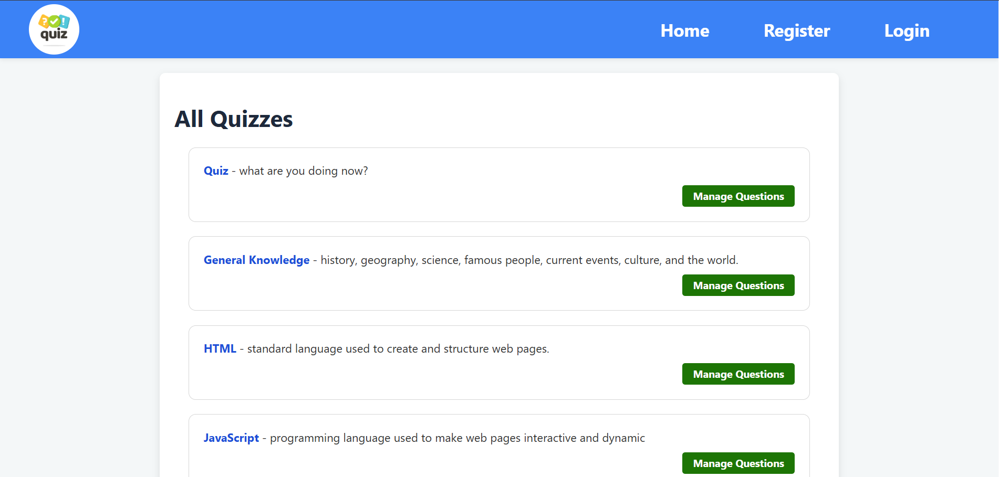
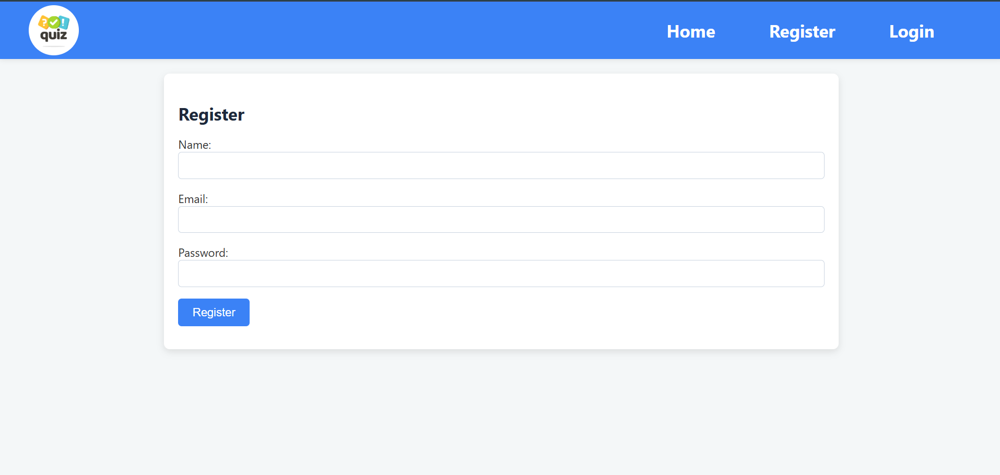
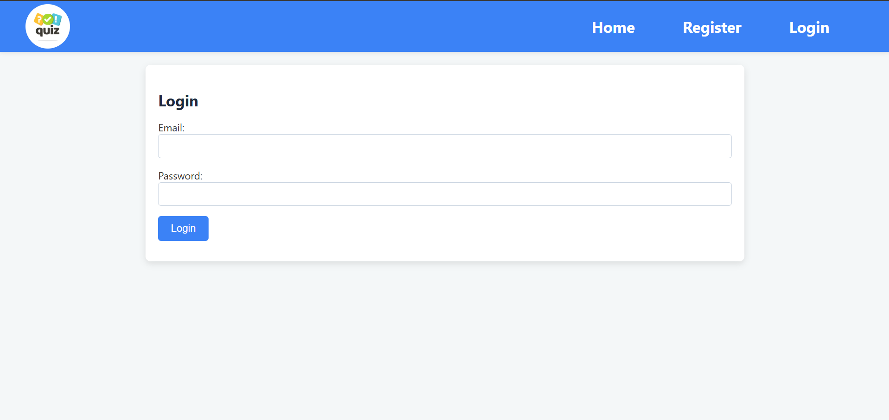
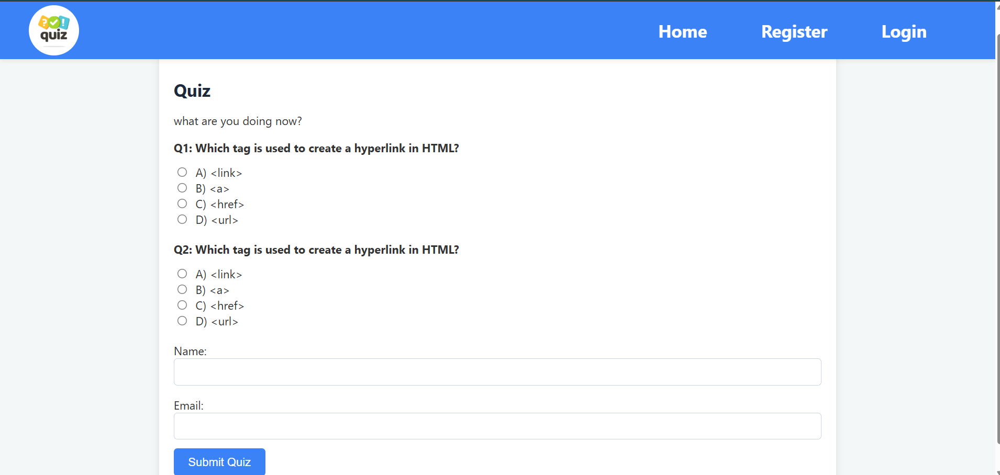
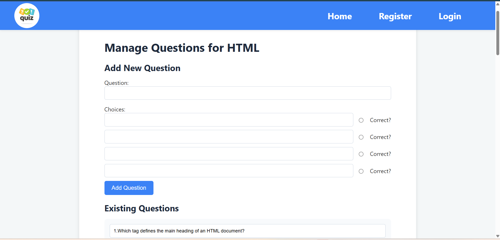

## Quiz App
### Templates
- base.html
- create_quiz.html
- edit.html
- index.html
- login.html
- manage_question.html
- quiz_take.html
- quiz_view.html
- register.html
- results.html

### Static
- style.css
- logo.png

### Python
`` app.py ``
`` data_seed.py``
`` forms.py``
`` models.py ``

## Web_site
### Home

### Register

### Login

### Quiz

### Manage Question

### Home page 
For home page show the user to see the  all quizzes and can quiz it. On the home page have link click to register and login also.

### Register
Register page is form when user want to create the question to quiz user can register when user do it can create the quiz.

### Login 
When user want to join the website to do or create the quiz user don't register user just login user can use it.

### Manage Question 
For this page user can update delete and edit the quetion on the title of question.